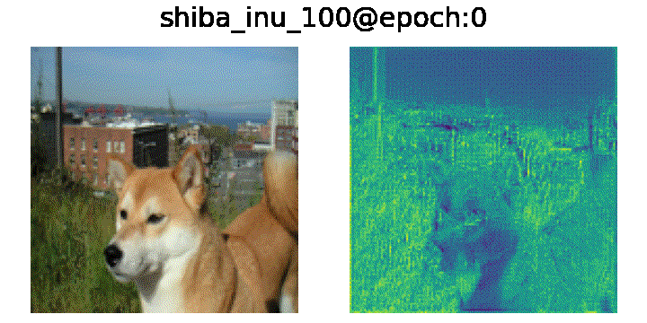
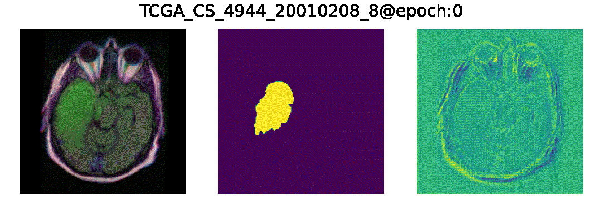

# UNet and BESNet for semantic segmentation


Customized implementation of [U-Net](https://arxiv.org/abs/1505.04597) and [BESNet](https://link.springer.com/chapter/10.1007%2F978-3-030-00934-2_26) in PyTorch and Keras (not updated yet) for [Oxford-IIIT Pet Dataset](https://www.robots.ox.ac.uk/~vgg/data/pets/) and [LGG Brain Segmentation Dataset](https://www.kaggle.com/mateuszbuda/lgg-mri-segmentation).

[Oxford-IIIT Pet Dataset](https://www.robots.ox.ac.uk/~vgg/data/pets/) contains 7,393 images and annotations of 37 different categories of pets (dogs and cats). The annotations include breed, head ROI, and pixel level trimap segmentation (background, edge, mask). In this project, only image and trimap segmentation were used.

[LGG Brain Segmentation Dataset](https://www.kaggle.com/mateuszbuda/lgg-mri-segmentation) contains 3,923 brain MR (FLAIR) images paired with segmentation masks. In the dataset, it does not have edges. To create edges, I used edge detection ([cv2.Canny](https://opencv-python-tutroals.readthedocs.io/en/latest/py_tutorials/py_imgproc/py_canny/py_canny.html)) in data/lgg-mri-segmentation/prepare_data.py.

## Downloading and Preparing Dataset

### [Oxford-IIIT Pet Dataset](https://www.robots.ox.ac.uk/~vgg/data/pets/)
1. Download: go to `data/oxford-iiit-pet` and download dataset by running command: `sh download_data.sh`
2. Prepare: go to `data/oxford-iiit-pet` and run: `python prepare_dataset.py`

### [LGG Brain Segmentation Dataset](https://www.kaggle.com/mateuszbuda/lgg-mri-segmentation)
1. Download: go to `data/lgg-mri-segmentation` and download dataset by running command: `sh download_data.sh` *** kaggle API is used here. If there is no kaggle API, go to [kaggle website](https://www.kaggle.com/mateuszbuda/lgg-mri-segmentation) to download.
2. Prepare: go to `data/lgg-mri-segmentation` and run: `python prepare_dataset.py`

## Training
```shell script
> python train.py -h
usage: train.py [-h] [-d DATA] [-s SAVE_NET] [-e NUM_EPOCH] [-b BATCH_SIZE]
                [-l LR] [-n NET] [--height HEIGHT] [--width WIDTH]
                [--alpha ALPHA] [--beta BETA] [--bece-loss BECE_LOSS]

optional arguments:
  -h, --help            show this help message and exit
  -d DATA, --data DATA  Which dataset? (pet OR mri) (default: pet)
  -s SAVE_NET, --save SAVE_NET
                        Save checkpoints (default: True)
  -e NUM_EPOCH, --epoch NUM_EPOCH
                        Number of epochs (default: 50)
  -b BATCH_SIZE, --batch BATCH_SIZE
                        Batch size (default: 8)
  -l LR, --learning-rate LR
                        Learning Rate (default: 0.001)
  -n NET, --net NET     Type of network to train (unet OR besnet) (default:
                        besnet)
  --height HEIGHT       Height of input image (default: 128)
  --width WIDTH         Width of input image (default: 128)
  --alpha ALPHA         Alpha value for BECE loss (for BESNet) (default: 0.5)
  --beta BETA           Beta value for BECE loss (for BESNet) (default: 1)
  --bece-loss BECE_LOSS
                        Loss for MDP in BESNet (BECE loss or BCE) (default:
                        True)
```
`-n` or `--net` argument takes parameters: <b>unet</b> or <b>besnet</b>. <b>unet</b> is for training <i>U-Net</i> and <b>besnet</b> is for training <i>BESNet</i>.

<i>BESNet</i> takes additional argument `--bece-loss` for whether to implement Boundary Enhanced Cross-Entropy (BECE) loss or not. To implement BECE loss, `--alpha` (0.5 by default) and `--beta` (1 by default) should be set as well.

## Example Images
### Pet Dataset
#### UNet

#### BESNet without BECE loss

#### BESNet with BECE loss


### MRI Dataset
#### UNet

#### BESNet without BECE loss

#### BESNet with BECE loss
